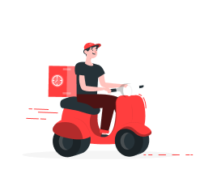
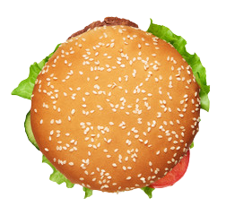
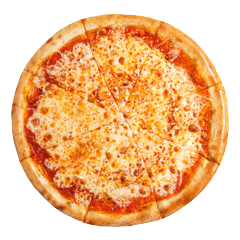

# Food-website

#index
<!DOCTYPE html>
<html lang="en">
<head>
    <meta charset="UTF-8">
    <meta name="viewport" content="width=device-width, initial-scale=1.0">
    <title>Food Website Design</title>

    <!-- STYLE CSS LINK -->
    <link rel="stylesheet" href="style.css">
    <!-- STYLE CSS LINK -->

    <!-- BOOTSTRAP CDN LINK -->
    <link href="https://cdn.jsdelivr.net/npm/bootstrap@5.0.2/dist/css/bootstrap.min.css" rel="stylesheet" integrity="sha384-EVSTQN3/azprG1Anm3QDgpJLIm9Nao0Yz1ztcQTwFspd3yD65VohhpuuCOmLASjC" crossorigin="anonymous">
    <!-- BOOTSTRAP CDN LINK -->

    <!-- FONT AWESOME CDN -->
    <link rel="stylesheet" href="https://cdnjs.cloudflare.com/ajax/libs/font-awesome/6.4.2/css/all.min.css">
    <!-- FONT AWESOME CDN -->

    <!-- GOOGLE FONTS LINK -->
    <link rel="preconnect" href="https://fonts.googleapis.com">
    <link rel="preconnect" href="https://fonts.gstatic.com" crossorigin>
    <link href="https://fonts.googleapis.com/css2?family=Josefin+Sans:wght@600&display=swap" rel="stylesheet">
    <!-- GOOGLE FONTS LINK -->
</head>
<body>
    

<!-- Navbar Start -->
<nav class="navbar navbar-expand-sm" id="navbar">
  
  <button class="navbar-toggler" type="button" data-bs-toggle="collapse" data-bs-target="#mynavbar">
    <i class="fa-solid fa-bars"></i>
  </button>
  

    <ul class="navbar-nav me-auto">
      <li class="nav-item">
        <a href="#" class="nav-link">Home</a>
      </li>
      <li class="nav-item">
        <a href="#" class="nav-link">Menu</a>
      </li>
      <li class="nav-item">
        <a href="#" class="nav-link">Order</a>
      </li>
      <li class="nav-item">
        <a href="#" class="nav-link">Reviews</a>
      </li>
      <li class="nav-item">
        <a href="#" class="nav-link">Contact</a>
      </li>
    </ul>

    <form class="d-flex">
      <input type="text" class="form-control me-2" placeholder="Search" required>
      <button type="button" id="btn">Search</button>
    </form>

  

</nav>
<!-- Navbar End -->

  
    

<!-- Home Section Start -->
<section class="home" id="home">
  

    <h3>Claim Best Offer   On Fast Food & Restaurant</h3>
    
The company itself is a very successful company. But, for some, less. We never accuse her of anything.

    <a href="#our-menu" id="home-btn">Our Menu</a>
  

  

    
  

</section>
<!-- Home Section End -->

<!-- Top Section Start -->

  <h5>WHAT WE SERVE</h5>
  <h3>Your Favourite Food   Delivery Partner</h3>
  

    

      

        
        

        <h1>Easy To Order</h1>
        
You only need a few steps in   ordering food

      

      

    

    

      

        
        

        <h1>Fastest Delivery</h1>
        
Delivery that is always ontime   even faster

      

      

    

    

      

        
        

        <h1>Best Quality</h1>
        
Not only fast for us quality is also   number one

      

      

    

  

<!-- Top Section End -->

<!-- Our Menu Start -->
<section class="menu" id="menu">
  <h3>Menu</h3>
  <h2>Delicious Dishes Is Here <i class="fa-solid fa-arrow-down"></i></h2>

  

    

      

        
        

          <h3>Golgappa</h3>
          <h6>The customer is very happy.</h6>
          

            <i class="fa-solid fa-star checked"></i>
            <i class="fa-solid fa-star checked"></i>
            <i class="fa-solid fa-star checked"></i>
            <i class="fa-solid fa-star checked"></i>
            <i class="fa-solid fa-star checked"></i>
          

          
Rs200 <i class="fa-solid fa-credit-card"></i>

        

      

    

    

      

        
        

          <h3>Samosa</h3>
          <h6>The customer is very happy.</h6>
          

            <i class="fa-solid fa-star checked"></i>
            <i class="fa-solid fa-star checked"></i>
            <i class="fa-solid fa-star checked"></i>
            <i class="fa-solid fa-star checked"></i>
            <i class="fa-solid fa-star checked"></i>
          

          
Rs300 <i class="fa-solid fa-credit-card"></i>

        

      

    

    

      

        
        

          <h3>Biryani</h3>
          <h6>The customer is very happy.</h6>
          

            <i class="fa-solid fa-star checked"></i>
            <i class="fa-solid fa-star checked"></i>
            <i class="fa-solid fa-star checked"></i>
            <i class="fa-solid fa-star checked"></i>
            <i class="fa-solid fa-star checked"></i>
          

          
Rs1200 <i class="fa-solid fa-credit-card"></i>

        

      

    

    

      

        
        

          <h3>Fried Rice</h3>
          <h6>The customer is very happy.</h6>
          

            <i class="fa-solid fa-star checked"></i>
            <i class="fa-solid fa-star checked"></i>
            <i class="fa-solid fa-star checked"></i>
            <i class="fa-solid fa-star checked"></i>
            <i class="fa-solid fa-star checked"></i>
          

          
Rs2000 <i class="fa-solid fa-credit-card"></i>

        

      

    

  

  

    

      

        
        

          <h3>Rasogulla</h3>
          <h6>The customer is very happy.</h6>
          

            <i class="fa-solid fa-star checked"></i>
            <i class="fa-solid fa-star checked"></i>
            <i class="fa-solid fa-star checked"></i>
            <i class="fa-solid fa-star checked"></i>
            <i class="fa-solid fa-star checked"></i>
          

          
Rs2000 <i class="fa-solid fa-credit-card"></i>

        

      

    

    

      

        
        

          <h3>Vada Pao</h3>
          <h6>The customer is very happy.</h6>
          

            <i class="fa-solid fa-star checked"></i>
            <i class="fa-solid fa-star checked"></i>
            <i class="fa-solid fa-star checked"></i>
            <i class="fa-solid fa-star checked"></i>
            <i class="fa-solid fa-star checked"></i>
          

          
Rs300 <i class="fa-solid fa-credit-card"></i>

        

      

    

    

      

        
        

          <h3>Rajma Chawal</h3>
          <h6>The customer is very happy.</h6>
          

            <i class="fa-solid fa-star checked"></i>
            <i class="fa-solid fa-star checked"></i>
            <i class="fa-solid fa-star checked"></i>
            <i class="fa-solid fa-star checked"></i>
            <i class="fa-solid fa-star checked"></i>
          

          
Rs1000 <i class="fa-solid fa-credit-card"></i>

        

      

    

    

      

        
        

          <h3>Sarso Ka Saagh</h3>
          <h6>The customer is very happy.</h6>
          

            <i class="fa-solid fa-star checked"></i>
            <i class="fa-solid fa-star checked"></i>
            <i class="fa-solid fa-star checked"></i>
            <i class="fa-solid fa-star checked"></i>
            <i class="fa-solid fa-star checked"></i>
          

          
Rs900 <i class="fa-solid fa-credit-card"></i>

        

      

    

  

</section>
<!-- Our Menu End -->

  

<!-- Our Menu Start -->
<section class="menu" id="menu">
  <h3>Our Menu</h3>

  

    

      

        
        

          <h3>Burger</h3>
          <h6>The customer is very happy.</h6>
          

            <i class="fa-solid fa-star checked"></i>
            <i class="fa-solid fa-star checked"></i>
            <i class="fa-solid fa-star checked"></i>
            <i class="fa-solid fa-star checked"></i>
            <i class="fa-solid fa-star checked"></i>
          

          
Rs500 <i class="fa-solid fa-credit-card"></i>

        

      

    

    

      

        
        

          <h3>Fast Food</h3>
          <h6>The customer is very happy.</h6>
          

            <i class="fa-solid fa-star checked"></i>
            <i class="fa-solid fa-star checked"></i>
            <i class="fa-solid fa-star checked"></i>
            <i class="fa-solid fa-star checked"></i>
            <i class="fa-solid fa-star checked"></i>
          

          
Rs500 <i class="fa-solid fa-credit-card"></i>

        

      

    

    

      

        
        

          <h3>Rice Dish</h3>
          <h6>The customer is very happy.</h6>
          

            <i class="fa-solid fa-star checked"></i>
            <i class="fa-solid fa-star checked"></i>
            <i class="fa-solid fa-star checked"></i>
            <i class="fa-solid fa-star checked"></i>
            <i class="fa-solid fa-star checked"></i>
          

          
Rs300 <i class="fa-solid fa-credit-card"></i>

        

      

    

    

      

        
        

          <h3>Pizza</h3>
          <h6>The customer is very happy.</h6>
          

            <i class="fa-solid fa-star checked"></i>
            <i class="fa-solid fa-star checked"></i>
            <i class="fa-solid fa-star checked"></i>
            <i class="fa-solid fa-star checked"></i>
            <i class="fa-solid fa-star checked"></i>
          

          
Rs300 <i class="fa-solid fa-credit-card"></i>

        

      

    

  

  

</section>
<!-- Our Menu End -->

<!-- Order Section Start -->
<section class="order" id="order">
  
Order Your Food

  

    

      

        
      

    

    

      <form action="#">

        

          <input type="text" class="form-control" id="name" placeholder="Enter Name" required>
        

        

          <input type="email" class="form-control" id="email" placeholder="Enter Email" required>
        

        

          <input type="number" class="form-control" id="number" placeholder="Enter Number" required>
        

         <textarea  class="form-control" id="comment" rows="5" name="text" placeholder="Enter Address" required></textarea>

         <button type="submit" class="order-btn">Order Now</button>
        

      </form>
    

  

</section>
<!-- Order Section End -->

<!-- Review Section Start -->
<section class="review" id="review">
  

    

      

        
      

    

    

      <h3>WHAT THEY SAY</h3>
      <h2>What Our Customers  Say About Us</h2>
      
The company itself is a very successful company. Distinction, greater advantages that seem to be held and pain!

      <h5><a href="#">Samarth</a></h5>
      <h5><a href="#">Sanvi</a></h5>
      

        <i class="fa-solid fa-star checked"></i>
        <i class="fa-solid fa-star checked"></i>
        <i class="fa-solid fa-star checked"></i>
        <i class="fa-solid fa-star checked"></i>
        <i class="fa-solid fa-star checked"></i>
      

    

  

</section>
<!-- Review Section End -->

<!-- Contact Section Start -->
<section class="contact" id="contact">
  

    Contact us
  

  

    

      <h3>Let's Get In Touch</h3>
      
The company itself is a very successful company. Like us, it's a lot of trouble in other ways!

      <i class="fa-solid fa-phone">+91-7006134588</i>  
      <i class="fa-solid fa-envelope">info@mail.com</i>  
      <i class="fa-solid fa-location-dot">Mumbai,India</i>
    

    

      <form action="#">
        

          <input type="text" class="form-control" id="name" placeholder="Enter Name" required>
        

        

          <input type="email" class="form-control" id="email" placeholder="Enter Email" required>
        

        

          <input type="number" class="form-control" id="number" placeholder="Enter Number" required>
        

         <textarea  class="form-control" id="comment" rows="5" name="text" placeholder="Enter Address" required></textarea>

         <button type="submit" class="order-btn">Order Now</button>
      </form>
    

  

</section>
<!-- Contact Section End -->

<!-- Footer Start -->
<footer id="footer">
  

    

    
Hello, it's really a pain to be followed. With that right, it is easy for anyone to run away from nothing.

    <i class="fa-brands fa-twitter"></i>
    <i class="fa-brands fa-instagram"></i>
    <i class="fa-brands fa-facebook-f"></i>
    <i class="fa-brands fa-youtube"></i>
    <i class="fa-brands fa-twitter"></i>
  

   
 
</footer>
<!-- Footer End -->

    <!-- BOOTSTRAP CDN LINK -->
    
    <!-- BOOTSTRAP CDN LINK -->

</body>
</html>

#css
*{
    margin: 0;
    padding: 0;
    text-decoration: none;
    list-style: none;
    scroll-behavior: smooth;
    font-family: 'Josefin Sans', sans-serif;
}
html::-webkit-scrollbar-track{
    background: transparent;
}
html::-webkit-scrollbar-thumb{
    background: #e53937;
    border-radius: 10px;
}
html::-webkit-scrollbar{
    width: 10px;
}

/* Navbar Start */
#navbar{
    background: transparent;
    padding: 0px 9% 0px;
}
#logo img{
    width: 190px;
    margin-top: 3px;
}
.nav-item .nav-link{
    color: black;
    font-size: 16px;
    font-weight: 550;
    transition: 0.5s;
}
.nav-item .nav-link:hover{
    color: #e53937;
}
#nvabar input{
    border-radius: 50px;
}
#btn{
    border-radius: 5px;
    padding: 5px;
    border: 1px solid #e53937;
    background: transparent;
    transition: 0.5s;
}
#btn:hover{
    background: #e53937;
    color: white;
}
/* Navbar End */

/* Home Section Start */
.home{
    width: 100%;
    height: 100vh;
    padding: 5px 11% 80px;
    display: flex;
    align-items: center;
    justify-content: center;
    flex-wrap: wrap;
    position: relative;
    z-index: 0;
}
.home .img{
    flex: 1 1 300px;
}
.home .img img{
    width: 100%;
    margin-left: 60px;
}
.home-content{
    flex: 1 1 400px;
    margin-top: 30px;
}
.home-content h3{
    font-size: 40px;
    font-weight: 700;
}
.home-content h3 span{
    color: #e53937;
}
#home-btn{
    padding: 10px;
    text-decoration: none;
    background: #e53937;
    color: white;
    border-radius: 5px;
}
@media screen and (max-width:873px){
    .home .img img{
        margin-left: 0px;
    }
}
/* Home Section End */

/* Top Section Start */
.top-section{
    padding: 10px 11% 100px;
}
.top-section h5{
    color: #e53937;
    text-align: center;
}
.top-section h3{
    color: black;
    text-align: center;
    font-weight: 600;
}
.top-section .row{
    margin-top: 30px;
    align-items: center;
}
.top-section .row .card{
    border: none;
}
.top-section .row .card img{
    width: 200px;
    margin: auto;
}
.top-section .card-body{
    text-align: center;
}
.top-section .card-body h1{
    font-size: 25px;
    font-weight: 600;
}
/* Top Section End */

/* Our Menu Strat */
.menu{
    padding: 100px 11% 100px;
}
.menu h3{
    text-align: center;
    color: #e53937;
}
.menu h2{
    text-align: center;
    color: black;
    font-weight: 600;
}
.menu h2 i{
    color: #e53937;
}
.menu h6{
    font-size: 16px;
}
.rating i{
    color: orange;
    font-size: 13px;
}
.menu p{
    margin-top: 5px;
    font-weight: bold;
}
.menu p i{
    float: right;
    color: #e53937;
    cursor: pointer;
}
/* Our Menu End */

/* Order Section Start */
.order{
    padding: 100px 11% 100px;
}
.heading{
    text-align: center;
    font-size: 30px;
    font-weight: 700;
}
.heading span{
    color: #e53937;
}
.order textarea{
    resize: none;
}
.order-btn{
    padding: 6px;
    margin-top: 30px;
    background: transparent;
    border: 2px solid #e53937;
    border-radius: 5px;
    color: #e53937;
    transition: 0.5s;
    cursor: pointer;
}
.order-btn:hover{
    background: #e53937;
    color: white;
    border: 2px solid white;
}
/* Order Section End */

/* Review Section Start */
.review{
    padding: 100px 11% 100px;
}
.review .card{
    border: 1px solid #e53937;
}
.review h3{
    font-size: 16px;
    color: #e53937;
    font-weight: 550;
}
.review h2{
    font-weight: 600;
}
.review h5{
    margin-top: 35px;
    display: inline-block;
}
.review h5 a{
    margin-left: 10px;
    color: black;
    text-decoration: none;
    font-weight: bold;
    letter-spacing: 1px;
    cursor: pointer;
}
.review h5 img{
    border-radius: 5px;
}

@media screen and(max-width: 636px){
    .review h3{
        margin-top: 10px;
    }
}
/* Review Section End */

/* Contact Section Start */
.contact{
    padding: 100px 11% 100px;
}
.contact .col-md-5{
    background: #e53937;
    border-radius: 10px;
    color: white;
}
.contact h3{
    margin-top: 30px;
}
.contact i span{
    margin-left: 10px;
    cursor: pointer;
}
/* Contact Section End */

/* Footer Start */
#footer{
    padding: 15px 11% 15px;
}
#footer .f-content{
    text-align: center;
}
.f-logo img{
    width: 250px;
    cursor: pointer;
}
.f-content i{
    font-size: 18px;
    color: black;
    padding: 10px;
    transition: 0.5s;
    cursor: pointer;
}
.f-content i:hover{
    background: #e53937;
    color: white;
    border-radius: 5px;
}
.c-content{
    text-align: center;
}
.c-content span a{
    text-decoration: none;
    color: #e53937;
    
}
/* Footer End */
